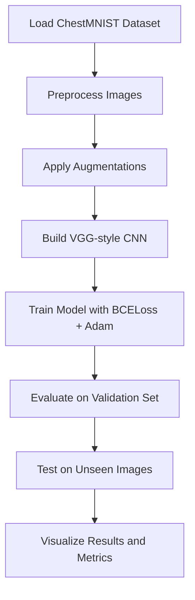

# Chest X-ray Classification using Custom VGG Network (MedMNIST - ChestMNIST)

##  Project Overview

This project focuses on building a deep learning system for **multi-label classification** of chest X-ray images (CXR) using a **manually implemented VGG-like CNN** architecture. The dataset used is **ChestMNIST**, which includes grayscale, low-resolution (28x28) images of 14 pulmonary pathologies.  

The goal is to automate medical image analysis, improve diagnostic accuracy, reduce the burden on radiologists, and provide accessible diagnostic tools in resource-limited settings.

---

##  Technologies Used

- **Python 3**
- **PyTorch** – For building and training the CNN model
- **MedMNIST** – Dataset and preprocessing utilities
- **Google Colab** – For training with GPU acceleration
- **Matplotlib / Seaborn** – Data visualization

---

##  Dataset Info (ChestMNIST)

- **Total Samples:** 112,120 grayscale CXR images  
- **Resolution:** 28x28 pixels  
- **Classes:** 14 thoracic diseases (multi-label per image)  
- **Split:** 70% train, 10% validation, 20% test  
- **Challenge:** Class imbalance and low image resolution  

---

## ⚙️ Model Overview

- **Architecture:** Manually implemented VGG-style CNN
- **Layers:** Two convolutional blocks with MaxPooling, followed by fully connected layers
- **Loss Function:** Binary Cross Entropy Loss (`BCELoss`)
- **Optimizer:** Adam (learning rate = 0.001)
- **Activation:** Sigmoid (multi-label output)
- **Training Epochs:** 20
- **Batch Size:** 64

---

##  Data Preprocessing and Augmentation

- Rescaled pixel values to [0, 1] and normalized to [-1, 1]
- Data augmentation:
  - Random rotation (±15°)
  - Translation (±10%)
  - Horizontal flip (50% probability)
- Mini-batch loading using PyTorch `DataLoader`

---

##  Results

- **Final Validation Loss:** ~0.1626  
- **Best Validation AUC:** ~0.7516 (19th epoch)  
- **Precision/Recall/F1-score:** Low for most rare classes  
- **Test Performance:** Model struggles with rare class recognition due to data imbalance

>  The model shows good general learning but is not reliable for clinical use due to class imbalance and low recall on rare diseases.

---

##  Key Performance Metrics

- **Precision, Recall, F1-score** (per-class and average)
- **Macro-F1 & Micro-F1**
- **AUC-ROC (per class and average)**

> Accuracy was intentionally not used due to imbalance – AUC and F1 provide more realistic insights.

---

##  Model Flow / Pipeline

---

##  Notebooks & Demo

You can try this project on Google Colab using the notebook below:

 [Colab Demo Notebook](https://colab.research.google.com/drive/1l-2Q8P6kfdRaKlfdrco-uXQ8a4V4Hbx4#scrollTo=odToZ59l18NT)  
 Main File: `MedMNIST_VGG.ipynb`

---

##  What Went Well

- Smooth training convergence, no overfitting
- Model correctly implemented from scratch
- AUC > 0.75 achieved on validation set

---

##  What Could Be Improved

- Handle class imbalance via oversampling, focal loss, or class weights
- Use higher-resolution data (e.g., CheXpert, ChestXray14)
- Apply transfer learning (e.g., ResNet, EfficientNet)
- Optimize classification thresholds per class
- Perform k-fold cross-validation

---

##  Future Work

- Add attention mechanisms
- Combine image data with clinical metadata
- Use explainable AI (e.g., Grad-CAM)
- Evaluate on external datasets

---

##  References

- [MedMNIST Website](https://medmnist.com/)
- Simonyan & Zisserman, 2014: *Very Deep Convolutional Networks for Large-Scale Image Recognition*
- Rajpurkar et al., 2017: *CheXNet: Radiologist-Level Pneumonia Detection*
- Irvin et al., 2019: *CheXpert Dataset*
